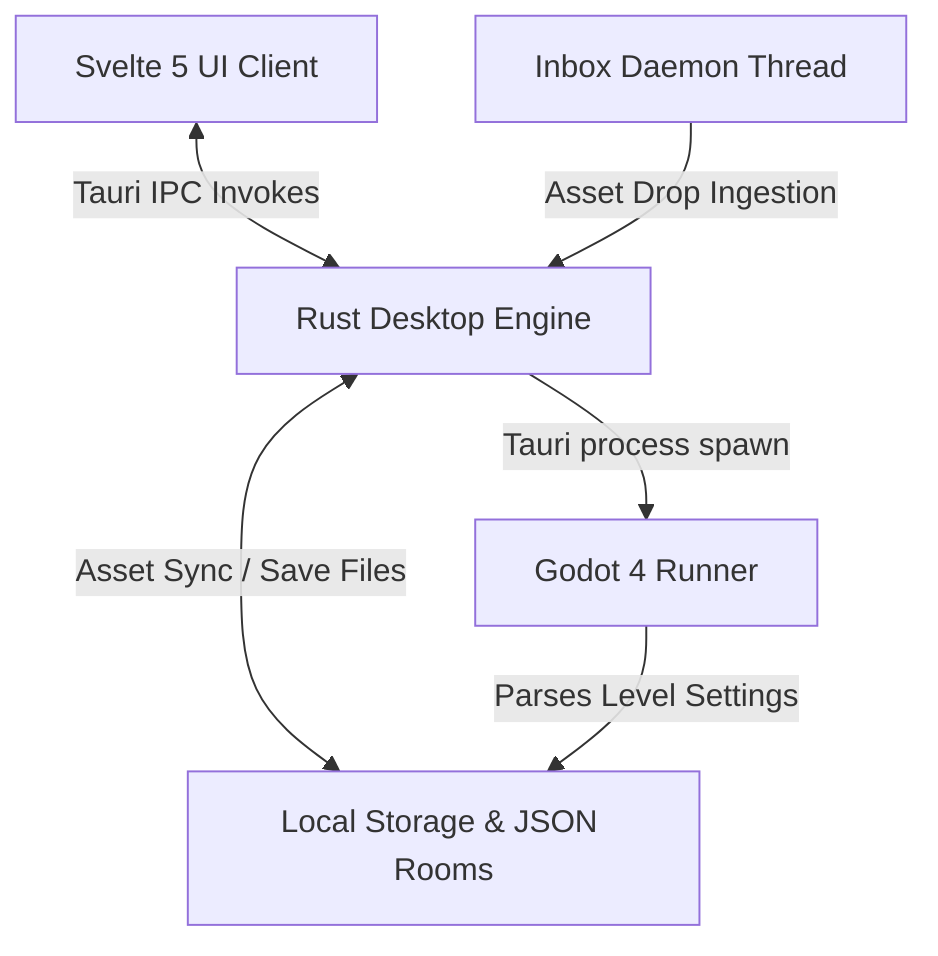

# 🧸 KidGameMaker

`KidGameMaker` is a contract-first, zero-code game creation suite designed for young children (ages 5+). Children can design 2D platforming adventures using simple visual stamp brushes and play them instantly, with all the heavy lifting hidden behind a magical, intuitive interface.

---

## 🎨 Modern Architecture

The suite splits game design and execution into three decoupled, secure components:



* **Editor Frontend**: Built with Svelte 5, TypeScript, and custom CSS. Handles placing toys, canvas panning/zooming, and rules customization.
* **Tauri Desktop Wrapper**: Integrates the Svelte frontend with local system resources using Tauri v2.
* **Rust Backend**: Manages file operations, folder-watching ingestion, connected-components sprite slicing, and packaging.
* **Godot Runner**: A 2D game runner written in GDScript. Reads `game_state.json`, translates physics vectors, parses rule events, and handles inputs.

---

## 🚀 Key Features

### 🛠️ Editor & Canvas
* **Drag-Paint Placement**: Drag stamps smoothly across the canvas to paint platforms, hazards, or collectibles.
* **Long-Press Repositioning**: Click and drag placed elements directly on the canvas to realign them.
* **Bookshelf Room Picker**: An interface to manage multiple rooms complete with mini-map rendering preview cards.
* **Undo/Redo History Stack**: Save/restore canvas states on the fly to undo mistakes.
* **Toybox Favorites**: Star (`🤍`/`❤️`) toys to pin them on a quick-select favorites ribbon. Persisted via browser `localStorage`.
* **🎲 Surprise Me! Generator**: Create complete, playable rooms procedural platform loops, rubies, patrolling enemies, and exit portals with a single tap.

### 💨 Magic Custom Rules Engine (No-Code If/Then Logic)
Create rules to trigger actions on in-game events without coding:
* **IF Triggers**:
  * 🔘 `button_step` (Floor Button Stepped)
  * 🕹️ `lever_flip` (Wall Lever Flipped)
  * 🎯 `target_hit` (Spinning Target practice hit by projectile/jump/hammer)
  * 💎 `coins_5` / `coins_10` (Collected 5/10 Rubies)
* **THEN Actions**:
  * 🚪 `toggle_gate` (Opens/Closes barrier tiles)
  * ✨ `spawn_sparkles` (Fires magic particle flares)
  * 💖 `heal_player` (Heals 20 HP)
  * 🔔 `play_sfx_chime` (Plays retro sound sweeps)

### 🔥 Elemental Chemistry Engine
Systemic interactions between elements and materials spread dynamically:
* **Fire Spread**: Wood and grass blocks are flammable. Fire spreads across adjacent wood/grass, turning them into ash after 4 seconds.
* **Water & Freezing**: Water pools extinguish fire. Spawning ice crystals nearby freezes water into solid, slippery ice blocks that player slides on.
* **Electric Chains**: Metal blocks conduct electricity, chaining lightning through connected metal structures to stun characters on contact for 1.5 seconds.
* **Wind Blows**: Wind zones apply physical force vectors to players, enemies, and physics contraptions.

### 🚀 Zonai Device Contraptions & Physics Gluing
Welding blocks and devices together to build vehicles or traps:
* **Emergent Gluing**: Any touching Zonai devices (Fans, Rockets, Balloons, Springs, Lasers, Batteries) and blocks (wood/metal) weld into a single dynamic `RigidBody2D` contraption at startup using a BFS connected components solver.
* **Zonai Fans**: Apply constant thrust in the stamped direction, complete with wind stream particles.
* **Zonai Rockets**: Apply a massive short-burst thrust, then burn out.
* **Zonai Balloons**: Apply upward buoyancy lift forces.
* **Zonai Springs**: Launch characters on impact.
* **Zonai Lasers**: Project a red raycast line that deals contact damage.
* **Zonai Batteries**: Contain energy capacity to power active devices; when battery capacity drains to 0, devices shut off.

### 🐝 AI Companion Swarm & Familiars
Helping hands follow you on your quest:
* **Pikmin Helper 🌱**: Follows and hops over walls. Can be thrown (`F` key) in a parabolic arc to latch onto enemies (halving speed and dealing tick damage) or press switches. Picks up nearby collectibles and carries them to the player. Can be recalled via whistle (`Q` key). Customizer options select element colors (Red = fire immune, Blue = swim, Yellow = electric immune).
* **Spooky Ghost 👻**: Hovers and drains health from nearby enemies to heal the player, showing visual drain beams.

### 🔨 Crafting, Cooking & Backpack UI
* **4x4 Grid Backpack Inventory**: Pressing `Tab` opens a grid backpack. Move items (Shield is 2x2, Sword is 1x2, Potion is 1x1) inside slots using Arrow keys and `Space`. Press `E` to consume potions or equip swords/shields.
* **Visual Crafting Bench**: Craft Swords, Fire Swords, Shields, and Potions from collected materials: **Metal Scrap 🔩**, **Fire Powder 🌶️**, **Green Herb 🌿**, and **Sweet Honey 🍯**.
* **BBQ Spit Cooking**: A Monster Hunter-style mini-game. Press `Space` at the perfect golden-brown color moment to hear `"SO TASTY! 🍖"` and gain a permanent Max HP boost. Burnt steak heals nothing.

### 🛡️ Difficulty Modes & Safety Options
* **Easy Mode**: Halves enemy damage, doubles initial player health, and slows down monster patrols.
* **Normal Mode**: Standard baseline challenge.
* **Creative Mode**: Invincible player mode displaying crowns (`👑`) on the health bar. Bypasses gravity limits to fly freely.
* **Calm Mode**: Disables enemy damage and swaps game over screens with immediate, healthy checkpoint respawns.

### 🌋 Atmosphere & Polish
* **Rising Hazards**: Global rules toggle to trigger slowly rising **🌊 Water** (drown damage) or **🌋 Lava** (lava burn damage).
* **Emote Wheel**: Tap number keys `1-5` during gameplay to display bouncing scaling emoji bubbles (`😊`, `😡`, `😱`, `🎉`, `💤`) that drift up and fade out.
* **Level Length Indicator**: Shows size tags in the canvas footer based on horizontal terrain bounds (`🎈 Short Adventure`, `🚀 Medium Adventure`, `🏰 Long Quest`, `👑 Epic Quest!`).

---

## 📂 Directory Structure

```text
/kidgamemaker
├── editor/                   # Tauri + Svelte desktop editor
│   ├── src/
│   │   ├── App.svelte         # Main editor workspace
│   │   ├── ToyboxModal.svelte # Star inventory modal
│   │   ├── BookshelfModal.svelte # Level cards modal
│   │   └── lib/canvasState.ts # Shared TypeScript contracts & item types
│   └── src-tauri/src/
│       ├── commands.rs        # Tauri Rust command invokes
│       ├── inbox.rs           # Watcher thread + Zip Slip guards
│       ├── slicer.rs          # Connected-components image slicing
│       └── lib.rs             # Application runner & handlers
├── engine/                   # Godot 4 game runtime
│   ├── scripts/
│   │   ├── Main.gd            # Spawns components, compiles levels, manages BGM, chemistry and contraptions
│   │   ├── PlayerController.gd # Player movement physics, backpack grid, emotes
│   │   ├── SmartEnemy.gd      # Patrolling, shooting, boss phases, elemental status effects
│   │   └── Collectible.gd     # Potions, rubies, and animation tweens
│   └── data/
│       ├── game_state.json    # Transpiled level payload
│       └── assets/            # Metadata sidecar descriptors per toy
├── _Inbox/                   # Drop assets here for watch ingestion
└── docs/                     # Technical specifications & roadmap guides
```

---

## 🚀 Getting Started

### Prerequisites
* **Node.js** (v18+)
* **Rust & Cargo** (for Tauri v2 compilation)
* **Godot Engine 4.x** (with PATH registered)

### 1. Launch the Editor
```bash
cd editor
npm install
npm run tauri:dev
```
The editor will compile, start, and locate your workspace directory.

### 2. Run the Game Client
* **Manual Editor Mode**: Open `engine/project.godot` in Godot 4, and run the main scene.
* **Direct Execution Mode** (if you have exported runner binaries):
  ```bash
  .\engine\Runner.exe --level-json .\engine\data\game_state.json
  ```

### 3. Ingesting Custom Assets
Drop `.png`, `.wav`, or `.zip` files into the `_Inbox/` folder. The background watcher daemon will parse, classify, create JSON metadata sidecars, and sync them to the Svelte inventory modal.

---

## 🔒 Security & Code Verification
* **PowerShell Escape Guards**: PowerShell process invocations are bypassed in favor of native Rust programmatic archiving using `zip::ZipWriter` and `zip::ZipArchive`, shielding the app from command injection.
* **Zip Slip Path Controls**: Archive extraction inside `inbox.rs` validates entry paths, skipping items resolving outside the target directories.
* **Content Security Policy (CSP)**: Tauri webview configuration strictly scopes script, image, and style protocols:
  `"csp": "default-src 'self' tauri: asset: https://asset.localhost; script-src 'self'; style-src 'self' 'unsafe-inline'; img-src 'self' data: asset: https://asset.localhost blob:;"`
* **Static Verification**:
  * Run TypeScript validation: `npm run check` (runs `tsc --noEmit`).
  * Verify Vite production bundling: `npm run build`.

---

## 🛠️ Codebase Standards & File Size Limits

To maintain modularity, readability, and ease of maintenance across Svelte, Rust, Python, and GDScript components:
* **File Size Limit**: No source file (code, Svelte components, scripts, markup, etc.) should exceed **500 lines** unless absolutely necessary.
* **Decomposition Policy**: If a file grows near or beyond 500 lines, it must be decomposed into smaller, single-responsibility modules, helper scripts, sub-components, or mixins.
