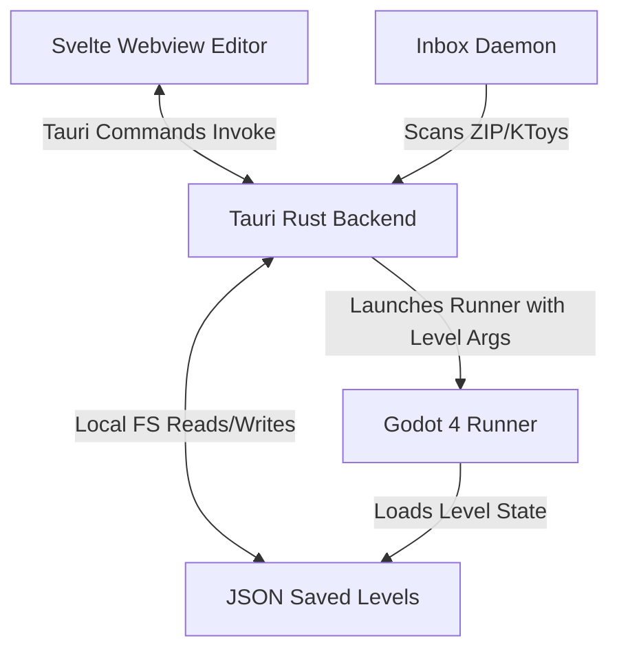

# 🧸 KidGameMaker — Codebase Context & Developer Guide

This document is designed to provide an LLM or human developer with a complete architectural breakdown, codebase layout, data schemas, and implemented features of the **KidGameMaker** workspace. Use this context to research, refactor, or expand the engine and editor.

---

## 1. Project Overview & Architecture

`KidGameMaker` is a kid-friendly, code-free game creation suite. It allows young children (ages 5+) to design, play, and package 2D platforming adventures.



### Technical Stack
1. **Editor Frontend**: Svelte (v5) + TypeScript + Vanilla CSS + Vite.
2. **Editor Desktop Wrapper**: Tauri (v2) exposing Rust side effects.
3. **Game Runner**: Godot 4.x (GDScript) running headlessly or windowed.
4. **Asset Ingestion Watcher**: Native Rust background daemon thread tracking folder events.

---

## 2. Core Directory Layout

* `editor/src/` — Svelte editor source code.
  * [`App.svelte`](file:///g:/kidgamemaker/editor/src/App.svelte) — The main single-page application combining canvas, toolbar, sidebar customizer, global rules wizard, and modal windows.
  * [`ToyboxModal.svelte`](file:///g:/kidgamemaker/editor/src/ToyboxModal.svelte) — Inventory selection catalog supporting favorite heart tags.
  * [`lib/canvasState.ts`](file:///g:/kidgamemaker/editor/src/lib/canvasState.ts) — TypeScript definitions for `PlacedEntity`, `WorldSettings`, `RoomPayload`, and the fallback toy catalog.
* `editor/src-tauri/src/` — Rust Tauri application.
  * [`lib.rs`](file:///g:/kidgamemaker/editor/src-tauri/src/lib.rs) — App setup and registered command definitions.
  * [`commands.rs`](file:///g:/kidgamemaker/editor/src-tauri/src/commands.rs) — FS operations (load/save/delete rooms, compile level configs, recursive programmatic directory zipping).
  * [`inbox.rs`](file:///g:/kidgamemaker/editor/src-tauri/src/inbox.rs) — Active directory watcher on `_Inbox/` tracking `.zip`/`.ktoy` assets, unboxing entries with Zip Slip path validation, and generating JSON metadata sidecars.
  * [`slicer.rs`](file:///g:/kidgamemaker/editor/src-tauri/src/slicer.rs) — Procedural sprite sheets slicing based on alpha threshold component scans.
* `engine/` — Godot 4 project directory.
  * [`scripts/Main.gd`](file:///g:/kidgamemaker/engine/scripts/Main.gd) — Core runner scene. Parses level JSON configurations, constructs platform colliders, overlays ambient lights, evaluates logic rules, and renders floating feedback labels.
  * [`scripts/PlayerController.gd`](file:///g:/kidgamemaker/engine/scripts/PlayerController.gd) — Character movement physics (running, jumping, flying, double-jump boots, gliding, trail color modulation, and bouncy emojis wheel).
  * [`scripts/SmartEnemy.gd`](file:///g:/kidgamemaker/engine/scripts/SmartEnemy.gd) — Patrolling, jumping, and chasing monster AI. Includes boss camera zooms, custom size modulators, and calm mode checks.
  * [`scripts/Collectible.gd`](file:///g:/kidgamemaker/engine/scripts/Collectible.gd) — Handles coin rewards, health points restoration, alchemy potions, and pop-up tween animations.
  * `data/assets/` — Category-routed assets and sidecar descriptors.

---

## 3. Supported Features Checklist

### 🕹️ Runner Gameplay Mechanics
* **Costume Wardrobe**: Multi-colored player tints (Storm Ninja, Fire Knight) that shift modulate colors and sync runner trail colors.
* **Ambient Lighting & Lanterns**: Toggleable day/night cycles (sunset orange, night dark). Equipping the **Lantern tool** projects a round light mask.
* **Toy Hammer & Bricks**: Destructible stone/ice tiles that shatter when struck by the hammer.
* **Conveyor Belts**: Left/right moving tracks sliding overlapping players/enemies.
* **Mystery Boxes**: Collision blocks executing slot spins before spawning items or slimes.
* **Gravity Flip Zones & Potions**: Area bounds that dynamically invert player gravity vectors.
* **Alchemy Potions**: Speed potions (cyan trail), Jump potions, and Growth potions (giant scales).
* **Glide & Jetpack Gear**: Glider capes (drifts down slowly) and jetpack thrusters.
* **NPC Shopkeepers**: Interactive traders selling tools for rubies.
* **Stomp Mechanics**: Jumping on top of enemies deals stomp damage and bounces the player.
* **Emote Wheel**: Numeric keys `1-5` show bouncy smiley overlays (`😊`, `😡`, `😱`, `🎉`, `💤`) above the player.

### 💨 Custom Rule Engine (No-Code If/Then Logic)
Children link action triggers dynamically inside the editor. Supported rule maps:
* **IF Triggers**: `button_step` (Floor Button), `lever_flip` (Wall Lever), `target_hit` (Spinning Target), `coins_5` (Collected 5 Rubies), `coins_10` (Collected 10 Rubies).
* **THEN Actions**: `toggle_gate` (Opens/Closes barrier tiles), `spawn_sparkles` (Magic particles), `heal_player` (Restores HP), `play_sfx_chime` (Sound effect trigger).

### ⚙️ Automation & Magic Polish
* **Calm Mode**: Makes enemies friendly and replaces the Game Over screen with immediate respawns.
* **Creative Mode**: Invincible player health bar (renders crowns `👑`) and enables flying movement.
* **Surprise Me Level Builder**: Single-click procedural builder constructing randomized theme setups.
* **Level Length Tags**: Footer tag analyzer analyzing canvas spans: `🎈 Short Adventure`, `🚀 Medium Adventure`, `🏰 Long Quest`, `👑 Epic Quest!`.
* **Rising Danger Hazards**: Slow lava/water level overlay that deals periodic threat damage.
* **Wind Zones**: CPUParticles2D vectors blowing bodies inside Area2Ds.

---

## 4. Key JSON Data Contracts

When the Svelte editor saves levels, it compiles rooms to a structured payload stored at `engine/data/rooms/`. Below is a representative JSON contract outline for the engine:

```json
{
  "schema_version": 1,
  "project_id": "demo_project",
  "room_id": "candy_spooky_cloud_492",
  "world_settings": {
    "theme": "candy",
    "time_of_day": "sunset",
    "weather": "clear",
    "difficulty": "normal",
    "calm_mode": false,
    "rising_hazard_type": "lava",
    "rising_hazard_speed": 20.0,
    "victory_rules": {
      "win_condition": "portal",
      "celebration": "confetti"
    },
    "loss_rules": {
      "lose_condition": "health_0",
      "action": "game_over"
    },
    "room_rules": [
      {
        "trigger_type": "target_hit",
        "trigger_id": "target_practice_e92ab",
        "action_type": "toggle_gate",
        "action_id": "gate_block_92a10"
      }
    ]
  },
  "entities": [
    {
      "instance_id": "player_hero_knight_820fa",
      "asset_id": "hero_knight",
      "category": "heroes",
      "type": "player",
      "position": { "x": 128.0, "y": 300.0 },
      "is_camera_target": true,
      "modifiers": {
        "variant": "default",
        "scale_multiplier": 1.0,
        "costume_id": "storm_ninja",
        "costume_tint": "#22d3ee"
      }
    },
    {
      "instance_id": "wind_zone_fa129",
      "asset_id": "wind_zone",
      "category": "decorations",
      "type": "wind_zone",
      "position": { "x": 480.0, "y": 200.0 },
      "modifiers": {
        "variant": "default",
        "scale_multiplier": 1.0,
        "wind_direction": "left",
        "wind_force": 300.0
      }
    }
  ]
}
```

---

## 5. Entry Points for Future Research & Upgrades

If you want to implement new features, here is where to look:

1. **Adding a New Toy/Stamp**:
   * Add the entry to `fallbackInventory` in [`canvasState.ts`](file:///g:/kidgamemaker/editor/src/lib/canvasState.ts).
   * Create a JSON sidecar inside `engine/data/assets/decorations/<toy_id>/<toy_id>.json`.
   * Intercept spawning in [`Main.gd`](file:///g:/kidgamemaker/engine/scripts/Main.gd) inside `_spawn_custom_decoration` or matching the category handler.
2. **Adding Custom Rule Actions or Triggers**:
   * Add new `<option>` tags inside the rule selectors of [`App.svelte`](file:///g:/kidgamemaker/editor/src/App.svelte).
   * Extend the evaluator checks in [`Main.gd`](file:///g:/kidgamemaker/engine/scripts/Main.gd) inside `execute_rules` or `notify_trigger`.
3. **Enhancing Physics & Traps**:
   * Extend [`PlayerController.gd`](file:///g:/kidgamemaker/engine/scripts/PlayerController.gd) for player-state transitions (e.g. wall climbing, swimming, sliding).
   * Extend [`SmartEnemy.gd`](file:///g:/kidgamemaker/engine/scripts/SmartEnemy.gd) for new attack mechanics (e.g., throwing bombs, deploying shields).
