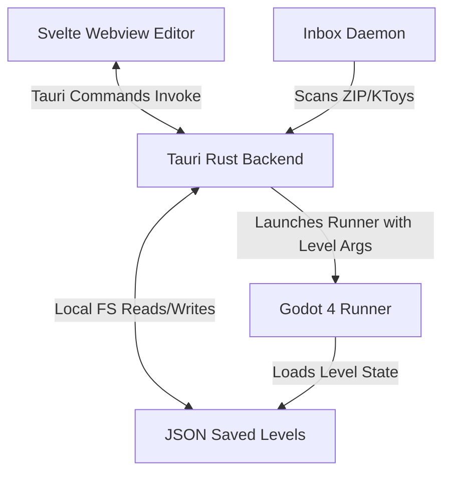

# 🧸 KidGameMaker — Codebase Context & Developer Guide

This document is designed to provide an LLM or human developer with a complete architectural breakdown, codebase layout, data schemas, and implemented features of the **KidGameMaker** workspace. Use this context to research, refactor, or expand the engine and editor.

---

## 1. Project Overview & Architecture

`KidGameMaker` is a kid-friendly, code-free game creation suite. It allows young children (ages 5+) to design, play, and package 2D platforming adventures.



### Technical Stack
1. **Editor Frontend**: Svelte (v5) + TypeScript + Vanilla CSS + Vite.
2. **Editor Desktop Wrapper**: Tauri (v2) exposing Rust side effects.
3. **Game Runner**: Godot 4.x (GDScript) running headlessly or windowed.
4. **Asset Ingestion Watcher**: Native Rust background daemon thread tracking folder events.

---

## 2. Core Directory Layout

* `editor/src/` — Svelte editor source code.
  * [`App.svelte`](file:///g:/kidgamemaker/editor/src/App.svelte) — Main editor application workspace including settings controls for new Zonai devices, Pikmin colors, and BBQ difficulty levels.
  * [`ToyboxModal.svelte`](file:///g:/kidgamemaker/editor/src/ToyboxModal.svelte) — Inventory selection catalog supporting favorite heart tags.
  * [`lib/canvasState.ts`](file:///g:/kidgamemaker/editor/src/lib/canvasState.ts) — Shared TypeScript contracts, item types, and the fallback inventory defining all default toy configurations.
* `editor/src-tauri/src/` — Rust Tauri application.
  * [`lib.rs`](file:///g:/kidgamemaker/editor/src-tauri/src/lib.rs) — App setup and registered command definitions.
  * [`commands.rs`](file:///g:/kidgamemaker/editor/src-tauri/src/commands.rs) — File operations (save, load, compile room JSONs).
  * [`inbox.rs`](file:///g:/kidgamemaker/editor/src-tauri/src/inbox.rs) — Inbox watching thread handling folder ingestion.
  * [`slicer.rs`](file:///g:/kidgamemaker/editor/src-tauri/src/slicer.rs) — Procedural sprite sheets slicing based on alpha threshold component scans.
* `engine/` — Godot 4 project directory.
  * [`scripts/Main.gd`](file:///g:/kidgamemaker/engine/scripts/Main.gd) — Core runner. Spawns entities, runs the chemistry tick spreading fire, freezing water, and propagating shock chains. Welds adjacent blocks and devices using a connected components BFS algorithm, creating a single dynamic `RigidBody2D` contraption. Instantiates CanvasLayer overlays for Backpack grid inventory, Crafting benches, and BBQ spits.
  * [`scripts/PlayerController.gd`](file:///g:/kidgamemaker/engine/scripts/PlayerController.gd) — Character movement physics. Handles job class multipliers, physics presets (Mario, Sonic, Celeste, Hollow Knight, Kirby), variable jump cuts, ceiling corner correction, auto-edge jumping, trail CPUParticles2D, shocked/burning status effects, slippery ice sliding physics, emote wheels, keyboard keys (`Tab` for backpack, `F` for throwing Pikmin, `Q` for whistling), and the 4x4 inventory insertion grid arrays.
  * [`scripts/SmartEnemy.gd`](file:///g:/kidgamemaker/engine/scripts/SmartEnemy.gd) — Patrolling/chasing enemy AI. Handles boss phases, custom health displays, shocked/frozen/burning status tick effects, and register hooks for latched Pikmin helpers (cutting patrol speeds in half).
  * [`scripts/Collectible.gd`](file:///g:/kidgamemaker/engine/scripts/Collectible.gd) — Handles coin rewards, health points restoration, alchemy potions, and pop-up tween animations.
  * [`scripts/RuntimeRuleExecutor.gd`](file:///g:/kidgamemaker/engine/scripts/RuntimeRuleExecutor.gd) — Logic rule execution engine. Resolves trigger-action mapping (e.g. toggles, spawns, sound triggers) and dynamically binds unlinked triggers to nearest doors/gates within 128px at level load.
  * [`scripts/RuntimeTutorialWhisperer.gd`](file:///g:/kidgamemaker/engine/scripts/RuntimeTutorialWhisperer.gd) — Tutorial helper and dynamic assist assessor. Tracks coordinates of repeated player deaths to output contextual helpful hints and triggers a dynamic assist mode to aid players on tricky segments.
  * `data/assets/` — Category-routed assets and sidecar descriptors.

---

## 3. Supported Features Checklist

### 🕹️ Runner Gameplay Mechanics
* **Costume Wardrobe**: Multi-colored player tints (Storm Ninja, Fire Knight) that shift modulate colors and sync runner trail colors.
* **🏃 Movement Feel (Physics) Presets**: Custom presets selectable in the Hero Customizer:
  * **Cozy Jumper 🧸** (Default kid-friendly movement configuration)
  * **Bouncy Plumber 🍄** (Mario-style high acceleration and snappy gravity)
  * **Super Speedster 🦔** (Sonic-style speed runs and low friction momentum)
  * **Snappy Knight 🪲** (Hollow Knight-style crisp responsive ground controls)
  * **Floaty Puff 🎈** (Kirby-style low gravity float/falls)
* **💨 Platformer Forgiveness**: Control adjustments designed for kids:
  * **Variable Jump Cuts**: Early jump button release dampens or cuts velocity.
  * **Ceiling Corner Correction**: Glides player around ceiling corner edges using horizontal nudging (up to 8px).
  * **Auto-Edge Jump**: Walk off ledges safely triggering a minor assist bounce when in Calm/Mellow difficulty.
* **Ambient Lighting & Lanterns**: Toggleable day/night cycles (sunset orange, night dark). Equipping the **Lantern tool** projects a round light mask.
* **Toy Hammer & Bricks**: Destructible stone/ice tiles that shatter when struck by the hammer.
* **Conveyor Belts**: Left/right moving tracks sliding overlapping players/enemies.
* **Mystery Boxes**: Collision blocks executing slot spins before spawning items or slimes.
* **Gravity Flip Zones & Potions**: Area bounds that dynamically invert player gravity vectors.
* **Alchemy Potions**: Speed potions (cyan trail), Jump potions, and Growth potions (giant scales).
* **Glide & Jetpack Gear**: Glider capes (drifts down slowly) and jetpack thrusters.
* **NPC Shopkeepers**: Interactive shop units selling tools for rubies.
* **Stomp Mechanics**: Jumping on top of enemies deals stomp damage and bounces the player.
* **Emote Wheel**: Numeric keys `1-5` show bouncy smiley overlays (`😊`, `😡`, `😱`, `🎉`, `💤`) above the player.

### 🔥 Elemental Chemistry Engine
Systemic interactions between elements and materials spread dynamically:
* **Fire Spread**: Wood and grass blocks are flammable. Fire spreads across adjacent wood/grass, turning them into ash after 4 seconds.
* **Water & Freezing**: Water pools extinguish fire. Spawning ice crystals nearby freezes water into solid, slippery ice blocks that player slides on.
* **Electric Chains**: Metal blocks conduct electricity, chaining lightning through connected metal structures to stun characters on contact for 1.5 seconds.
* **Wind Blows**: Wind zones apply physical force vectors to players, enemies, and physics contraptions.

### 🚀 Zonai Device Contraptions & Physics Gluing
Welding blocks and devices together to build vehicles or traps:
* **Emergent Gluing**: Any touching Zonai devices (Fans, Rockets, Balloons, Springs, Lasers, Batteries) and blocks (wood/metal) weld into a single dynamic `RigidBody2D` contraption at startup using a BFS connected components solver.
* **Zonai Fans**: Apply constant thrust in the stamped direction, complete with wind stream particles.
* **Zonai Rockets**: Apply a massive short-burst thrust, then burn out.
* **Zonai Balloons**: Apply upward buoyancy lift forces.
* **Zonai Springs**: Launch characters on impact.
* **Zonai Lasers**: Project a red raycast line that deals contact damage.
* **Zonai Batteries**: Contain energy capacity to power active devices; when battery capacity drains to 0, devices shut off.

### 🐝 AI Companion Swarm & Familiars
Helping hands follow you on your quest:
* **Pikmin Helper 🌱**: Follows and hops over walls. Can be thrown (`F` key) in a parabolic arc to latch onto enemies (halving speed and dealing tick damage) or press switches. Picks up nearby collectibles and carries them to the player. Can be recalled via whistle (`Q` key). Customizer options select element colors (Red = fire immune, Blue = swim, Yellow = electric immune).
* **Spooky Ghost 👻**: Hovers and drains health from nearby enemies to heal the player, showing visual drain beams.

### 🔨 Crafting, Cooking & Backpack UI
* **4x4 Grid Backpack Inventory**: Pressing `Tab` opens a grid backpack. Move items (Shield is 2x2, Sword is 1x2, Potion is 1x1) inside slots using Arrow keys and `Space`. Press `E` to consume potions or equip swords/shields.
* **Visual Crafting Bench**: Craft Swords, Fire Swords, Shields, and Potions from collected materials: **Metal Scrap 🔩**, **Fire Powder 🌶️**, **Green Herb 🌿**, and **Sweet Honey 🍯**.
* **BBQ Spit Cooking**: A Monster Hunter-style mini-game. Press `Space` at the perfect golden-brown color moment to hear `"SO TASTY! 🍖"` and gain a permanent Max HP boost. Burnt steak heals nothing.

### 💨 Custom Rule Engine (No-Code If/Then Logic)
Children link action triggers dynamically inside the editor. Supported rule maps:
* **IF Triggers**: `button_step` (Floor Button), `lever_flip` (Wall Lever), `target_hit` (Spinning Target), `coins_5` (Collected 5 Rubies), `coins_10` (Collected 10 Rubies).
* **THEN Actions**: `toggle_gate` (Opens/Closes barrier tiles), `spawn_sparkles` (Magic particles), `heal_player` (Restores HP), `play_sfx_chime` (Sound effect trigger).
* **🔌 Proximity Auto-Solver**: Links unlinked triggers (buttons, levers, pressure plates) within 128px of gates/doors automatically.

### ⚙️ Automation & Magic Polish
* **Calm Mode**: Makes enemies friendly and replaces the Game Over screen with immediate respawns.
* **Creative Mode**: Invincible player health bar (renders crowns `👑`) and enables flying movement.
* **🤖 Dynamic Assists**: Tracks coordinates of player failures. Repeated deaths (3+) in a single region reduce enemy speed by 30% and boost coyote time / jump buffer tolerances to 0.22s.
* **Surprise Me Level Builder**: Single-click procedural builder constructing randomized theme setups.
* **Level Length Tags**: Footer tag analyzer analyzing canvas spans: `🎈 Short Adventure`, `🚀 Medium Adventure`, `🏰 Long Quest`, `👑 Epic Quest!`.
* **Rising Danger Hazards**: Slow lava/water level overlay that deals periodic threat damage.
* **Wind Zones**: CPUParticles2D vectors blowing bodies inside Area2Ds.

---

## 4. Key JSON Data Contracts

When the Svelte editor saves levels, it compiles rooms to a structured payload stored at `engine/data/rooms/`. Below is a representative JSON contract outline for the engine:

```json
{
  "schema_version": "2.0.0",
  "project_id": "demo_project",
  "room_id": "candy_spooky_cloud_492",
  "world_settings": {
    "theme": "candy",
    "time_of_day": "sunset",
    "weather": "clear",
    "difficulty": "normal",
    "calm_mode": false,
    "rising_hazard_type": "lava",
    "rising_hazard_speed": 20.0,
    "victory_rules": {
      "win_condition": "portal",
      "celebration": "confetti"
    },
    "loss_rules": {
      "lose_condition": "health_0",
      "action": "game_over"
    },
    "room_rules": [
      {
        "trigger_type": "target_hit",
        "trigger_id": "target_practice_e92ab",
        "action_type": "toggle_gate",
        "action_id": "gate_block_92a10"
      }
    ]
  },
  "movement_system": {
    "_meta": { "feature_domain": "movement_system", "minimum_schema_version": "2.0.0" },
    "enabled": true,
    "movement_ids": ["wall_jump", "double_jump", "dash", "glide", "ledge_grab", "ground_pound"],
    "params": {
      "dash_cooldown_seconds": 1.2,
      "dash_duration_seconds": 0.2,
      "wall_cling_seconds": 0.3,
      "glide_stamina_seconds": 4.0,
      "ground_pound_speed": 900
    }
  },
  "combat_system": {
    "_meta": { "feature_domain": "combat_system", "minimum_schema_version": "2.0.0" },
    "enabled": true,
    "mechanics": ["sword_combo", "charge_shot", "parry", "shield_block"],
    "params": {
      "combo_steps": 3,
      "combo_reset_seconds": 1.0,
      "parry_window_seconds": 0.18,
      "charge_shot_full_seconds": 1.0
    }
  },
  "rules_engine": {
    "_meta": { "feature_domain": "rules_engine", "minimum_schema_version": "2.0.0" },
    "enabled": true,
    "primitives": ["switch_door", "key_lock", "pressure_plate", "collectible_counter", "win_condition"]
  },
  "ai_assist": {
    "_meta": { "feature_domain": "ai_assist", "minimum_schema_version": "2.0.0" },
    "level_balancer": true,
    "tutorial_whisperer": true
  },
  "entities": [
    {
      "instance_id": "player_hero_knight_820fa",
      "asset_id": "hero_knight",
      "category": "heroes",
      "type": "player",
      "position": { "x": 128.0, "y": 300.0 },
      "is_camera_target": true,
      "modifiers": {
        "variant": "default",
        "scale_multiplier": 1.0,
        "costume_id": "storm_ninja",
        "costume_tint": "#22d3ee"
      }
    },
    {
      "instance_id": "wind_zone_fa129",
      "asset_id": "wind_zone",
      "category": "decorations",
      "type": "wind_zone",
      "position": { "x": 480.0, "y": 200.0 },
      "modifiers": {
        "variant": "default",
        "scale_multiplier": 1.0,
        "wind_direction": "left",
        "wind_force": 300.0
      }
    }
  ]
}
```

---

## 5. Entry Points for Future Research & Upgrades

If you want to implement new features, here is where to look:

1. **Adding a New Toy/Stamp**:
   * Add the entry to `fallbackInventory` in [`canvasState.ts`](file:///g:/kidgamemaker/editor/src/lib/canvasState.ts).
   * Create a JSON sidecar inside `engine/data/assets/decorations/<toy_id>/<toy_id>.json`.
   * Intercept spawning in [`Main.gd`](file:///g:/kidgamemaker/engine/scripts/Main.gd) inside `_spawn_custom_decoration` or matching the category handler.
2. **Adding Custom Rule Actions or Triggers**:
   * Add new `<option>` tags inside the rule selectors of [`App.svelte`](file:///g:/kidgamemaker/editor/src/App.svelte).
   * Extend the evaluator checks in [`Main.gd`](file:///g:/kidgamemaker/engine/scripts/Main.gd) inside `execute_rules` or `notify_trigger`.
3. **Enhancing Physics, Contraptions, Chemistry, or Companions**:
   * Extend [`PlayerController.gd`](file:///g:/kidgamemaker/engine/scripts/PlayerController.gd) for player-state transitions, backpack grid usage, and inputs.
   * Extend [`SmartEnemy.gd`](file:///g:/kidgamemaker/engine/scripts/SmartEnemy.gd) for status effect modifiers, AI movement speeds, or new custom behavior states.
   * Extend [`Main.gd`](file:///g:/kidgamemaker/engine/scripts/Main.gd) to process chemistry spreading or battery force additions.

---

## 6. Codebase Standards & File Size Limits

To maintain modularity, readability, and ease of maintenance:
* **File Size Limit**: No source file (code, Svelte components, scripts, markup, etc.) should exceed **500 lines** unless absolutely necessary.
* **Decomposition Policy**: If a file grows near or beyond 500 lines, it must be decomposed into smaller, single-responsibility modules, helper scripts, sub-components, or mixins.
